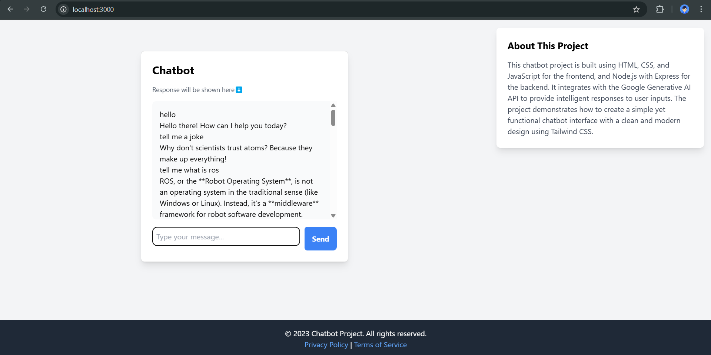

# Chatbot Project

This chatbot project is built using HTML, CSS, and JavaScript for the frontend, and Node.js with Express for the backend. It integrates with the Google Generative AI API to provide intelligent responses to user inputs. The project demonstrates how to create a simple yet functional chatbot interface with a clean and modern design using Tailwind CSS.

# Image Demo


## Installation Guide

Follow these steps to set up and run the chatbot project on your local machine.

### Prerequisites

- Node.js (v14 or higher)
- npm (v6 or higher)

### Steps

1. **Clone the repository:**

   ```bash
   git clone https://github.com/your-username/chatbot-project.git
   cd chatbot-project
2. **Install dependencies:**

    ```bash
    npm install

3. Set up environment variables:
    Create a .env file in the root of the project and add your Google Generative AI API key:

    ```bash
    GEMINI_API_KEY=your-gemini-api-key

4. Run the server:

    ```bash
        node server.js

5. Open the application in your browser:
    Open your web browser and navigate to http://localhost:3000.


Project Structure

```code
chatbot-project/
├── node_modules/
├── public/
│   ├── index.html
│   ├── styles.css
│   └── app.js
├── .env
├── .gitignore
├── package.json
├── package-lock.json
└── server.js
``` 

**Technologies Used**
Frontend:
    HTML
    CSS (Tailwind CSS)
    JavaScript

Backend:
    Node.js
    Express
    API:

Google Generative AI API
Features
Responsive design using Tailwind CSS
Intelligent responses using Google Generative AI API
Simple and clean user interface
